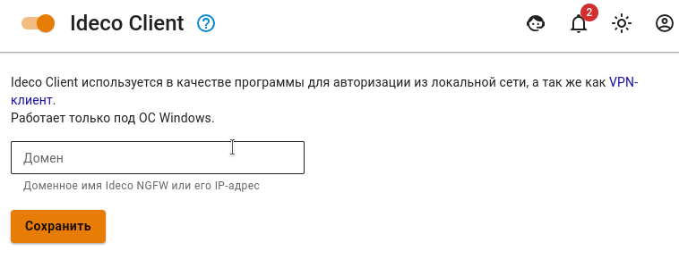
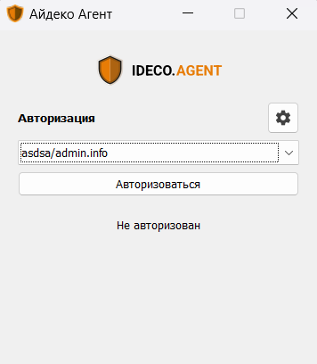

# Ideco Client



Название службы раздела **Ideco Сlient**: `ideco-agent-backend`; `ideco-agent-websocket`. \
Список служб для других разделов доступен по [ссылке](../../../ngfw/settings/server-management/terminal.md).

Использует протокол Wireguard.





Установить программу Ideco Client можно только на ОС семейства Windows с 10 версии и новее.



Ideco Client управляет авторизацией пользователей при подключении к Ideco NGFW в локальной сети и по VPN из внешних сетей.



Программа должна быть установлена на рабочей станции пользователя.

Порты для подключения, если NGFW за NAT:

* 80 TCP - для работы сертификатов let's encrypt;
* 14765 TCP и 3051 UDP  - для работы Ideco Client.

Для корректного подключения создайте в разделе **Пользователи -> VPN-подключения -> Доступ по VPN** правило, разрешающее пользователю VPN-подключение.



## Установка Ideco Client

* Перейдите в раздел **Пользователи –> Ideco-Client**, переведите опцию **Ideco Client** в положение включен, введите доменное имя в соответствующей строке и нажмите **Сохранить**. Появится кнопка **Скачать Ideco Client**:

* В личном кабинете пользователя по кнопке **Скачать Ideco VPN-клиент для Windows** или **Скачать Ideco Client** для пользователя Active Directory:

Сохраните и запустите двойным кликом файл установки программы *IdecoAgent.msi*.

Если требуется заранее установить адрес подключения, запустите файл из командной строки с ключом `utm_address=имя_домена` (перейдите в директорию с файлом `cd [путь до файла]` и вызовите файл с ключом `IdecoAgent.msi utm_address=имя_домена`);

## Настройка профиля для первого запуска



Перед подключением к Ideco NGFW по внешнему IP-адресу или доменному имени без сертификата `Let's encrypt` импортируйте корневой сертификат Ideco NGFW на компьютер.

Для импорта сертификата на компьютер выполните действия:

<!-- * Дважды кликните на скачанный файл сертификата;
* В открывшемся окне выберите **Установить сертификат**;
* Откроется **Мастер импорта сертификатов. В качестве **Расположения хранилища** выберите **Локальный компьютер**;
* Выберите пункт **Поместить все сертификаты в следующее хранилище**, нажмите **Обзор** и выберите папку **Доверенные корневые центры сертификации**;
* Нажмите **Ок -> Далее -> Готово**.-->



1\. После установки запустите Ideco Client. Программа установит связь с сервером и предложит ввести данные. Дальнейший формат ввода логина и хоста зависит от количества доменов, в которые введен NGFW:

2\. Введите **логин** в домене, в качестве **хоста** укажите домен или IP-адрес.

 

3\. Нажмите **Сохранить**, чтобы создать новый профиль пользователя для авторизации;

4\. Для авторизации выберите профиль пользователя из выпадающего списка и нажмите **Авторизоваться**.

## Редактирование профиля

1\. Перейдите в раздел **Настройки**, кликнув по ;

2\. Выберите профиль для редактирования, нажав , и внесите изменения в поля формы;

3\. Сохраните изменения в полях формы, нажав кнопку **Сохранить**.

## Особенности работы Ideco Client

* Опцией автоматического подключения может обладать только один профиль. При активации опции автоподключения другому профилю у предыдущего автоподключение будет отключено.
* Если компьютер уже находится в домене, то Client создаст для текущего пользователя SSO-профиль с включенным автоподключением. В ином случае нужно будет добавить стандартный профиль, воспользовавшись [инструкцией](#nastroika-profilya-dlya-pervogo-zapuska);
* Ошибка с текстом **Неизвестная ошибка** возникает при попытке повторной авторизации уже авторизованного по IP пользователя;
* При обновлении запуск приложения Ideco Client необходимо выполнять вручную. С 18-й версии запуск осуществляется автоматически.



Чтобы исключить взаимодействие пользователя с приложением, нужно установить Client на доменный компьютер с ключом хоста NGFW. В этом случае авторизация для пользователей этого компьютера будет происходить через их SSO-профиль по умолчанию в "тихом" режиме автоподключения.



При подключении из локальной и внешней сети пользователи появятся в разделе [Авторизованные пользователи](../../../ngfw/settings/monitor/authorized-users.md).