# Установка и настройка Ideco Client на MacOS

## Особенности работы Ideco Client на MacOS

* Ideco Client для MacOS требует версии системы 12.7 и выше;
* Чтобы трафик клиента при подключении через Ideco Client шел через Ideco NGFW, необходимо в разделе **Пользователи -> VPN-подключения -> Передача маршрутов** выбрать настройку **Отправлять весь трафик на Ideco NGFW (Использовать Ideco NGFW как шлюз по умолчанию)**;
* [HIP-профили](../../../../ngfw/settings/users/hip-profiles.md) на стороне агента поддерживаются **не в полном объеме**:



- Доступные HIP-профили

  * ОС;
  * процесс;
  * антивирус (Kaspersky).

- Недоступные HIP-профили

  * домен;
  * межсетевой экран;
  * реестр (всегда только Windows);
  * службы (всегда только Windows);
  * пакет обновлений Knowledge Base (всегда только Windows).



## Скачивание



- Для администратора

  Перейдите в раздел **Пользователи –> Ideco-Client**, переведите опцию **Ideco Client** в положение **Включен**, нажмите **Скачать под MacOS**:

  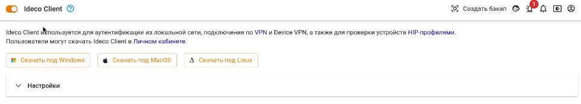

- Для пользователя

  Нажмите кнопку **Скачать под MacOS** в личном кабинете пользователя:

  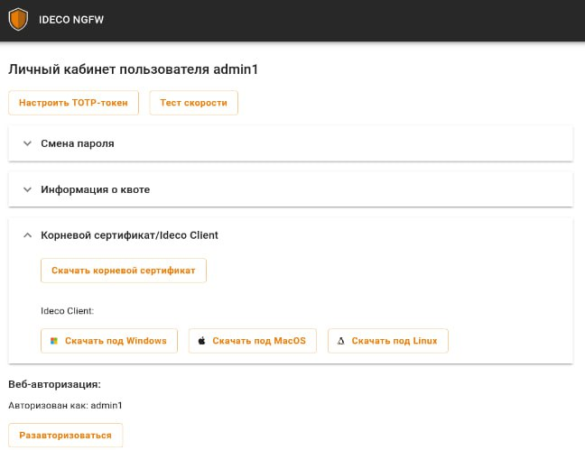



## Установка

В некоторых версиях MacOS необходимо явно разрешить установку приложения не из App Store. Для этого перейдите в раздел **Защита и безопасность -> Основные** и разрешите использование приложений, загруженных из **App Store и от подтвержденных разработчиков**:

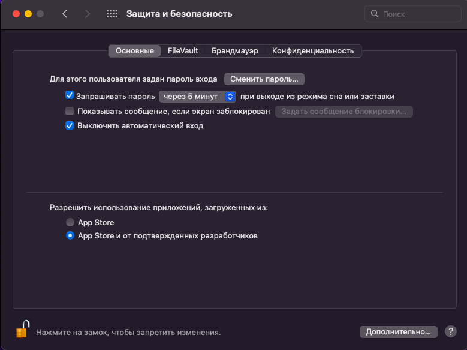

Чтобы установить **Ideco Client** на MacOS, выполните действия:

1\. Кликните по файлу *IdecoClient.pkg* правой кнопкой мыши и выберите **Открыть**. 

{#top}



1\. При открытии файла *IdecoClient.pkg* система сообщит о потенциальной опасности приложения. Нажмите **Готово**:

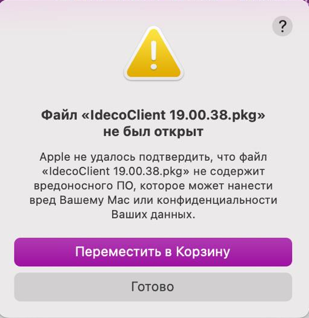

2\. Перейдите в раздел **Конфиденциальность и безопасность** и нажмите **Все равно открыть** рядом с именем файла:

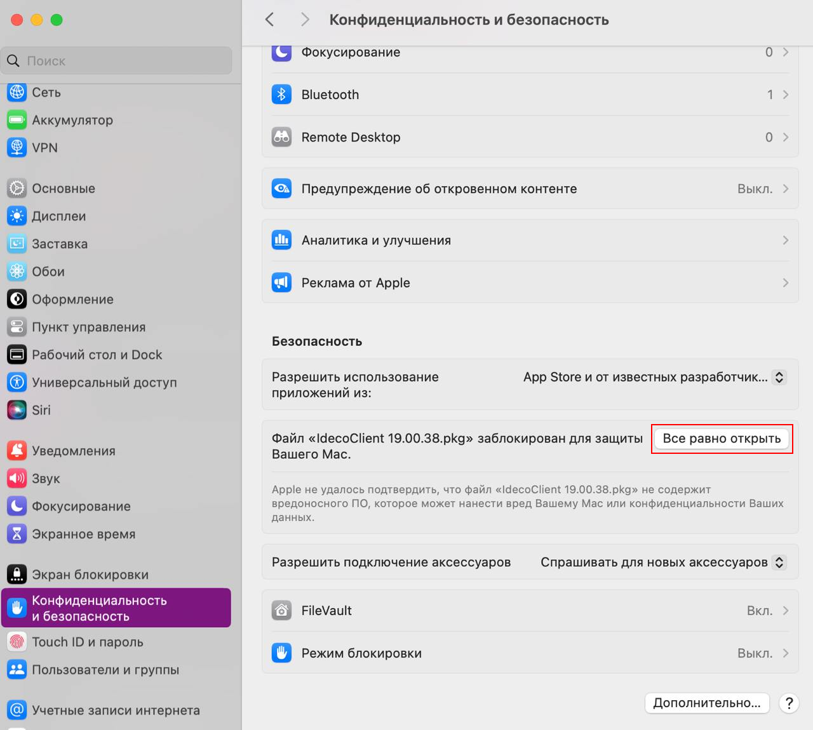



{#top}



При открытии файла *IdecoClient.pkg* система выдаст предупреждение. Подтвердите действие:

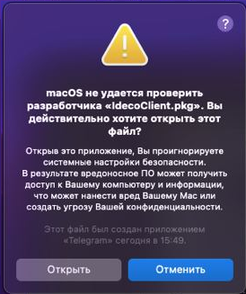



2\. Нажмите **Продолжить**. В открывшемся окне нажмите **Установить**:

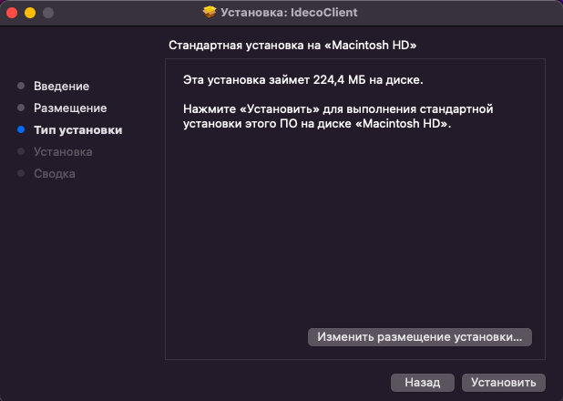

3\. Если установка завершилась успешно, на экране появится соответствующее сообщение:

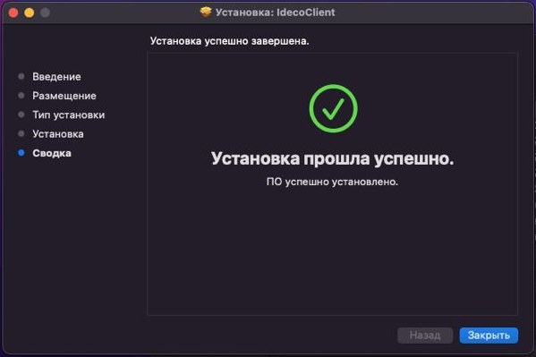

## Настройка профиля для первого запуска

Перед подключением к Ideco NGFW по внешнему IP-адресу или доменному имени без сертификата Let’s Encrypt импортируйте корневой сертификат Ideco NGFW на компьютер и убедитесь, что срок действия сертификата на домен или IP-адрес составляет **825 дней**.

Если срок действия сертификата превышает 825 дней, [загрузите](../../../../ngfw/settings/services/certificates/upload-ssl-certificate-to-server.md) на Ideco NGFW сертификат со сроком действия, не превышающим 825 дней, или [перевыпустите](../../../../ngfw/settings/services/certificates/README.md#процесс-перевыпуска-сертификата) автоматически сгенерированный сертификат.

{#top}



Скачайте корневой сертификат Ideco NGFW в разделе **Сервисы -> Сертификаты -> Загруженные сертификаты** в веб-интерфейсе NGFW или в личном кабинете пользователя по кнопке **Скачать корневой сертификат**. 

**Важно!** **Не храните** файл сертификата в директориях *Desktop*, *Documents* и *Downloads*: в этом случае Ideco Client не сможет получить доступ к этим файлам и прочитать их. Рекомендуем сохранить файлы в другую директорию, например, в корневую директорию домашней папки пользователя.

Чтобы установить сертификат на MacOS, выполните действия:

1\. Откройте скачанный файл *root_ca.crt* в приложении **Связка ключей**, сертификат Ideco NGFW появится в папке **Система**:

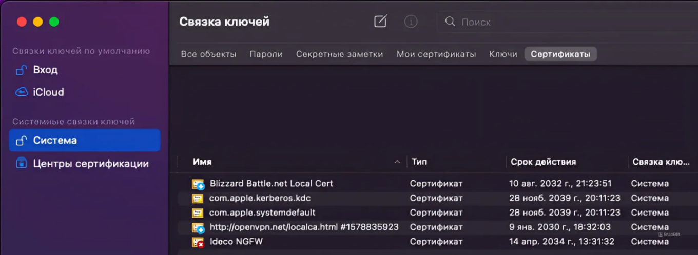

2\. Нажмите по сертификату правой кнопкой мыши и выберите **Свойства**.

3\. Установите в поле **Параметры использования сертификата** действие **Всегда доверять**:

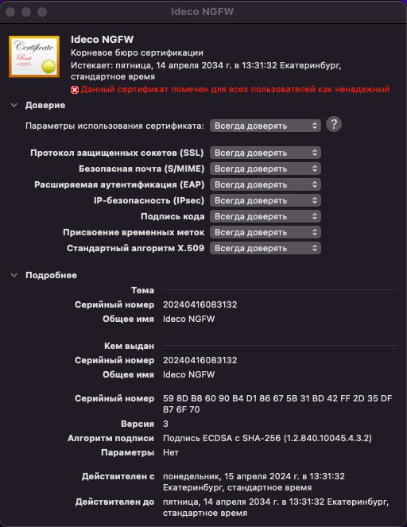

4\. Закройте окно свойств сертификата. Теперь сертификат помечен как надежный для всех пользователей устройства:

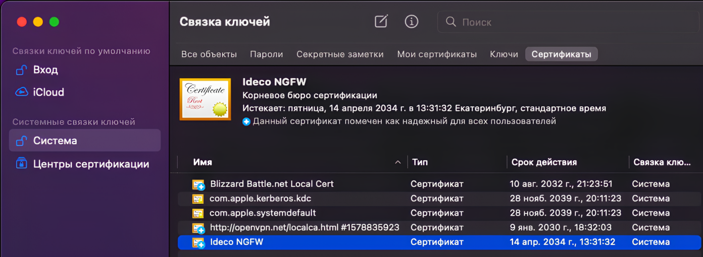

Также сертификат можно добавить с помощью команды:

```
sudo security add-trusted-cert -d -r trustRoot -k /Library/Keychains/System.keychain/Users/<учетная запись>/Downloads/root_ca.crt
```

5\. Перезагрузите компьютер.



## Первый запуск

1\. Запустите Ideco Client. Программа установит связь с сервером.

2\. Введите данные:

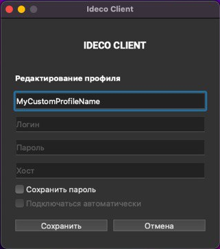

* **Имя профиля** - может не совпадать с логином и будет использоваться при выборе профиля для авторизации.
* **Пароль** - укажите пароль пользователя;
* **Логин** и **Хост** - укажите логин и хост в зависимости от количества доменов, в которые введен NGFW:

{#top}



Введите **логин** в домене, в качестве **хоста** укажите домен или IP-адрес.

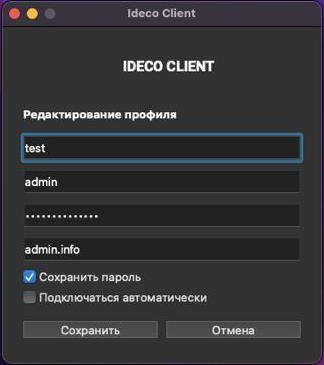



{#top}



Введите **логин** в формате **имя_домена/имя_пользователя**, в качестве **хоста** укажите **IP NGFW**.

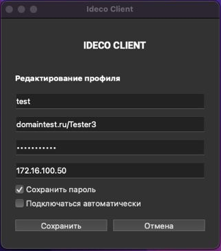



3\. Нажмите **Сохранить**.

4\. Для авторизации выберите профиль пользователя из выпадающего списка и нажмите **Авторизоваться**:

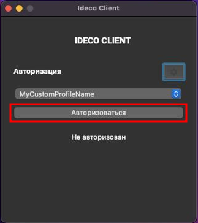

## Редактирование профиля

1\. Перейдите в раздел **Настройки**, кликнув по .

2\. Выберите профиль для редактирования, нажав , и внесите изменения в поля формы.

3\. Сохраните изменения в полях формы, нажав кнопку **Сохранить**.