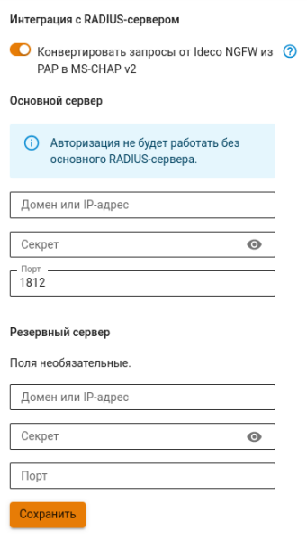

# Интеграция с RADIUS-сервером



При отключенной интеграции с RADIUS-сервером пользователи RADIUS не смогут аутентифицироваться на NGFW.



## Настройка интеграции



Ideco NGFW также поддерживает интеграцию с RADIUS-администраторами. Подробные инструкции по настройке описаны в статье [Администраторы](../../../ngfw/settings/server-management/admins.md).





Доступна аутентификация только VPN-пользователей NGFW через RADIUS-сервер.

Для взаимодействия с основным RADIUS-сервером по умолчанию используется порт 1812.



Для настройки интеграции с RADIUS-сервером выполните действия:

1\. Перейдите в раздел **Пользователи -> RADIUS** и включите опцию **RADIUS**.

2\. Укажите доменное имя или IP-адрес внутреннего RADIUS-сервера и секрет (пароль доступа). Если требуется, поменяйте порт, по которому будет происходить подключение к серверу:

3\. Оставьте опцию **Конвертировать запросы от Ideco NGFW из PAP в MS-CHAP v2** включенной или отключите ее и настройте на RADIUS-сервере двухфакторную аутентификацию. 

3\. Нажмите **Сохранить**.



При наличии в сети двух RADIUS-серверов настройте один как резервный с указанием порта подключения.

При отсутствии ответа от основного RADIUS-сервера запрос об аутентификации будет перенаправлен на резервный RADIUS-сервер. 



## Двухфакторная аутентификация 

Двухфакторная аутентификация для пользователей RADIUS-сервера доступна только при авторизации через [Ideco Client](../../../ngfw/settings/users/ideco-client/README.md).

По умолчанию Ideco Client использует для аутентификации на внешнем сервере протокол MS-CHAP v2. При отключении опции **Конвертировать запросы от Ideco NGFW из PAP в MS-CHAP v2** запросы аутентификации от Ideco Client к внешнему серверу будут выполняться по протоколу PAP. Для всех прочих VPN-подключений продолжает работать только MS-CHAP v2 независимо от настройки.

Если необходимо обеспечить для пользователей RADIUS-сервера двухфакторную аутентификацию: 

1\. В веб-интерфейсе Ideco NGFW в разделе **Пользователи -> RADIUS** отключите опцию **Конвертировать запросы от Ideco NGFW из PAP в MS-CHAP v2**: с использованием MS-CHAP v2 проверку второго фактора обеспечить невозможно.

2\. Настройте RADIUS-сервер на работу с протоколом PAP. **Важно:** даже если внешний сервер настроен на аутентификацию по PAP, Ideco NGFW не поддерживает этот протокол для прочих типов VPN-подключений.

3\. Настройте на RADIUS-сервере механизм двухфакторной аутентификации. Настраивать 2FA на Ideco NGFW **не нужно**.



Не отключайте опцию **Конвертировать запросы от Ideco NGFW из PAP в MS-CHAP v2**, если:

* Требуется защита от перехвата пароля между NGFW и RADIUS-сервером;
* RADIUS-сервер поддерживает только MS-CHAP v2.

Опция **Конвертировать запросы от Ideco NGFW из PAP в MS-CHAP v2** влияет только на подключения через Ideco Client, ее переключение никак не влияет на подключение пользователей по другим типам [VPN](../../../ngfw/settings/users/authorization/vpn-connection/README.md).



## Механизм добавления пользователей в дерево Ideco NFGW

1\. При подключении пользователя к Ideco NGFW происходит поиск пользователя в дереве пользователей NGFW. 

2\. Если пользователь не будет найден в дереве NGFW, NGFW отправит запрос к RADIUS-серверу на аутентификацию пользователя.

3\. При отсутствии группы **RADIUS** на Ideco NGFW группа будет пересоздаваться при аутентификации пользователей RADIUS-сервера. 

4\. После аутентификации пользователь будет добавлен в группу **RADIUS** на Ideco NGFW.

Если пользователь уже есть в группе **RADIUS**, то запрос на аутентификацию сразу будет отправлен на **RADIUS-сервер**.



Группу и пользователей **RADIUS** можно использовать для создания правил фильтрации трафика и других задач.





Ограничения для группы и пользователей RADIUS:

* Запрещено менять параметры пользователя (в том числе поля **Имя** и **Комментарий**), за исключением опции **Запретить доступ**;
* Разрешено удалять и переименовывать группу **RADIUS**;
* Запрещено удалять пользователей;
* Запрещено перемещать пользователей в другие группы;
* Запрещено перемещать других пользователей NGFW в группу **RADIUS**;
* Запрещена настройка IP и MAC авторизации для пользователей группы;
* Недоступна авторизация пользователей группы в личном кабинете и веб-почте.



