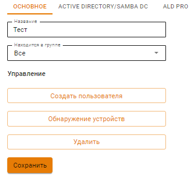
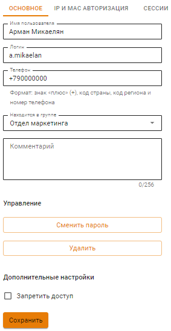
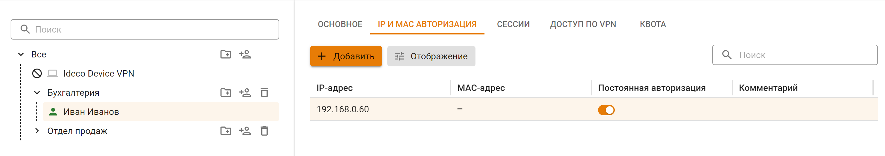
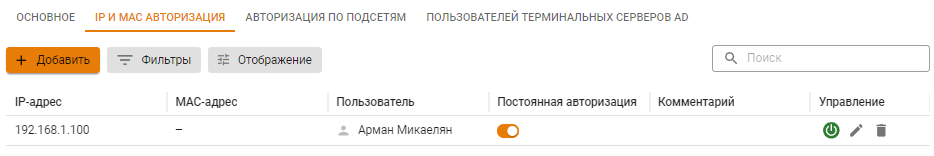
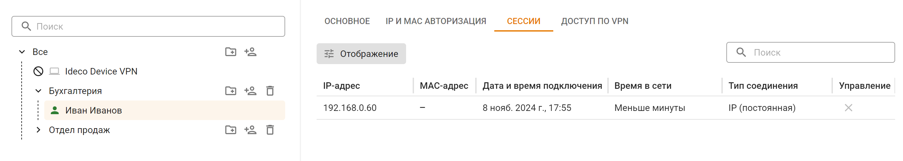
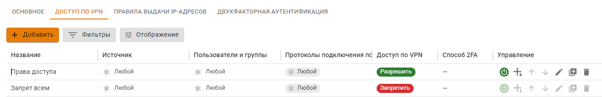
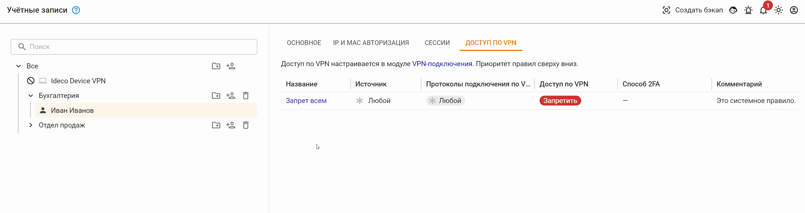
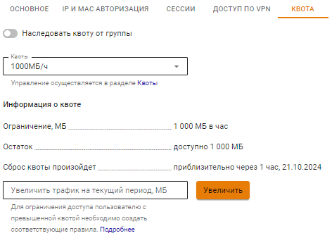

# Настройка пользователей

Чтобы изменить параметры учетной записи пользователя или группы пользователей, выберите нужный объект в дереве пользователей. 

## Группы пользователей

В группы можно добавлять как отдельные учетные записи пользователей, так и другие группы, объединяя их вместе. Настройки, заданные для группы, автоматически применяются ко всем ее участникам.



- Основное

    

    * **Изменить название и вложенность группы**. Для этого в соответствующем поле введите новое название и укажите группу, в которую требуется переместить эту группу;
    * **Создать пользователя**. При нажатии на одноименную кнопку появится форма создания пользователя;
    * **Обнаружение устройств**. При нажатии на одноименную кнопку откроется раздел [Обнаружение устройств](../../../../ngfw/settings/users/device-discovery.md);
    * **Удаление группы**. Вместе с группой удаляются учетные записи пользователей группы и привязки по IP- и MAC-адресам.

- Active Directory/Samba DC

    Категория содержит информацию об имени домена и типе группы. Процесс настройки синхронизации с Active Directory/Samba DC и импорт пользователей описан в статье [Интеграция с Active Directory/Samba DC](../../../../ngfw/settings/users/active-directory/).

- ALD Pro

    Категория содержит информацию об имени домена ALD Pro и типе группы. Процесс настройки синхронизации с ALD Pro и импорт пользователей описан в статье [Интеграция с ALD Pro](../../../../ngfw/settings/users/ald-pro.md). 

- Квота

    Категория позволяет распространить квоту на всех пользователей этой группы, у которых в персональной квоте включена опция **Наследовать квоту от группы**.\
    Для каждой группы пользователей есть аналогичная опция. Группы наследуют квоту, установленную в вышестоящей группе.



## УЗ пользователей



- Основное

    Основные настройки включают параметры, определяющие статус учетных записей пользователя. Базовые параметры:

    

    * **Имя пользователя** - имя пользователя, например, Иванов Иван. Максимальное количество символов - 128;
    * **Логин** - будет применяться пользователем для авторизации в различных службах Ideco NGFW. Логин необходимо вводить латинскими символами в нижнем регистре. **Не используйте в качестве логина IP-адрес.** Максимальное количество символов - 32;
    * **Телефон** - телефон для [двухфакторной аутентификации](../../../../ngfw/settings/users/two-factor-authentication.md). Формат: +, код страны, код региона и номер телефона;
    * **Находится в группе** - используйте это поле для перемещения пользователя в другую группу;
    * **Запретить доступ** - при установке этого флага пользователь не сможет авторизоваться, соответственно - пользоваться ресурсами интернета, почтой и личным кабинетом.

    Для пользователей из [Active Directory](../../../../ngfw/settings/users/active-directory/README.md) и [ALD Pro](../../../../ngfw/settings/users/ald-pro.md) на вкладке **Основное** нельзя редактировать имя, логин, телефон, менять группу или пароль.

- IP и MAC авторизация

    Категория содержит правила авторизации по IP и MAC, созданные для определенного пользователя в двух разделах:

    * **Пользователи -> Учетные записи -> IP и MAC авторизация**:

    

    * **Пользователи -> [Авторизации](../../../../ngfw/settings/users/authorization/README.md) -> [IP и MAC авторизация](../../../../ngfw/settings/users/authorization/ip-and-mac-authorization/README.md)**:

    

    Правила **IP и MAC авторизации** создают аналогичную привязку в [DHCP-сервере](../../../../ngfw/settings/services/dhcp.md) Ideco NGFW. Однако, если те же адреса указаны во включенных правилах DHCP-сервера, то они будут выполняться в первую очередь.

- Сессии

    Содержит таблицу с информацией обо всех активных сессиях пользователях:

    

    При нажатии на  в столбце **Управление** NGFW разорвет сессию пользователя.\
    Аналогичная таблица расположена в разделе **Мониторинг ->** [**Авторизованные пользователи**](../../../../ngfw/settings/monitor/authorized-users.md).

- Доступ по VPN

    Категория позволяет просматривать правила доступа VPN, которые настраиваются в разделе **VPN-подключения -> Доступ по VPN**.

    

    Для перехода к общей таблице доступа VPN из дерева пользователей нажмите на нужное название правила:

    

- Квота

    Категория позволяет просматривать и увеличивать квоту пользователя в случае использования лимитов трафика:

    

    Для увеличения квоты воспользуйтесь полем **Увеличить трафик на текущий период**.



{#top}



Пользователю назначена квота на 1000 МБ на неделю (с понедельника по воскресенье). К четвергу количество трафика превысило значение, заданное квотой. Требуется единоразово предоставить пользователю дополнительный трафик.

Для предоставления дополнительного трафика выполните действия:

1\. Введите в поле **Увеличить трафик на текущий период** значение, на которое нужно увеличить квоту, и нажмите **Увеличить**.

2\. Убедитесь, что в строке **Остаток** отражен весь доступный трафик с учетом добавленного.



