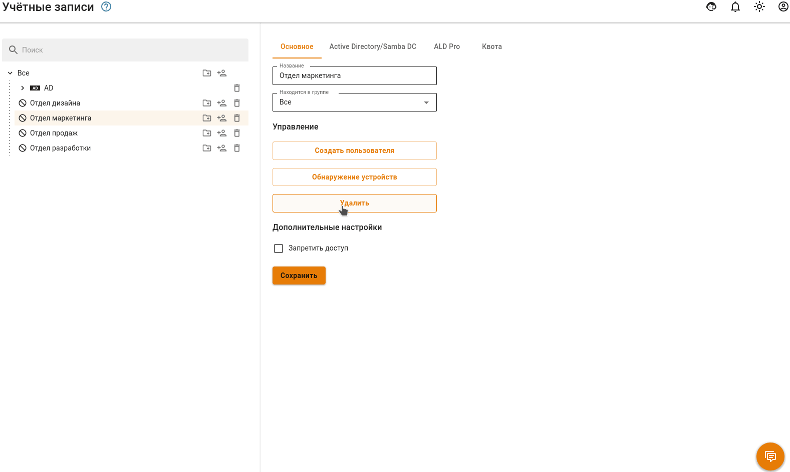
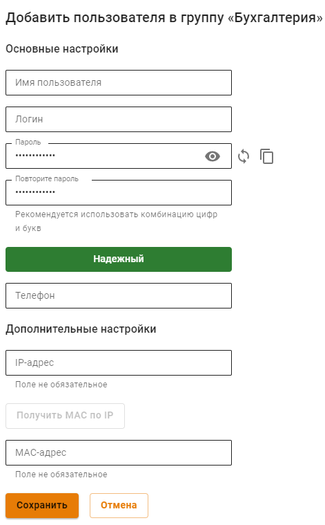
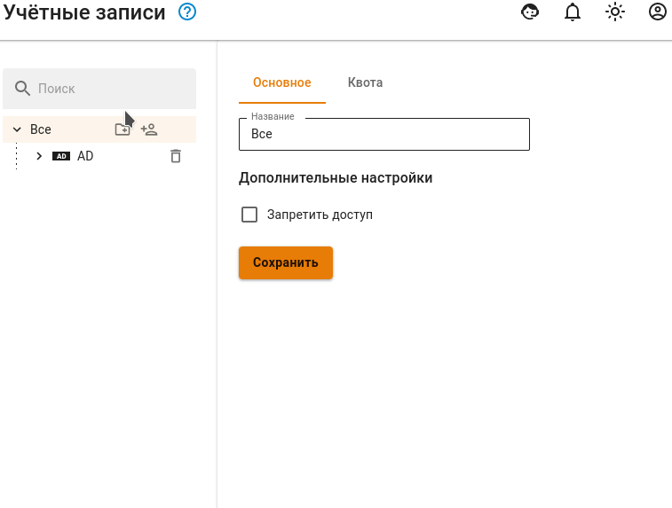
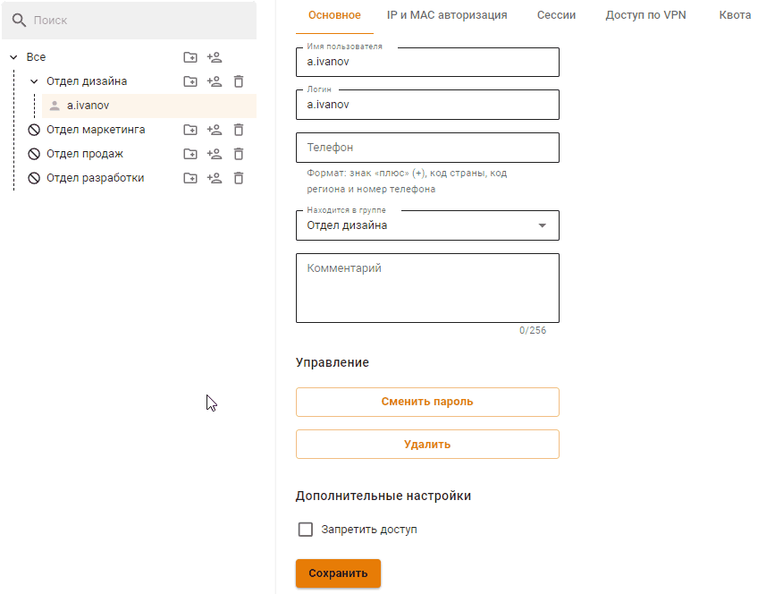
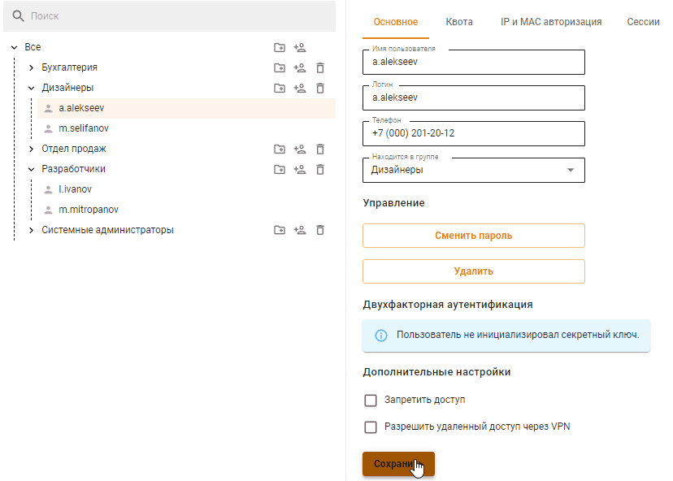

# Управление пользователями

## Общее

В дереве пользователей есть соответствующие кнопки, чтобы управлять группами и учетными записями:

|                                    Обозначение                                   | Описание                                       |
| :------------------------------------------------------------------------------: | ---------------------------------------------- |
|  | Создать учетную запись пользователя            |
|    | Создать группу                                 |
|            | Удалить учетную запись пользователя или группу |

## Создание учетной записи пользователя

Чтобы создать учетную запись в определенной группе, нажмите в ней на иконку создания пользователя. Внешний вид элементов управления был проиллюстрирован в таблице выше.

Второй способ создания пользователя в группе - выбрать нужную группу и нажать на кнопку **Создать пользователя** в правой части окна во вкладке **Основное**.

Далее появится окно с формой создания учетной записи пользователя:



**Логин** необходимо вводить латинскими символами в нижнем регистре, например: i.ivanov. 

Рекомендации к созданию сложности **паролей**: минимальная длина - 10 символов; использование строчных и заглавных латинских символов; использование цифр и специальных символов. Можно автоматически сгенерировать пароль. 

**Телефон** указывается для [Двухфакторной аутентификации](../two-factor-authentication.md).

При заполнении **Дополнительных настроек** будет создано соответствующее правило в карточке пользователя во вкладке **IP и MAC авторизация** и в разделе **Авторизация -> IP и MAC-авторизация**. \
Но если данный IP-адрес или MAC-адрес будет использоваться в правилах [DHCP-сервера](../../services/dhcp.md), то правило DHCP-сервера будет выполняться в приоритете.

Кнопка **Получить MAC по IP** будет активна если IP пользователя и IP Ideco UTM в одной подсети.



Для учетных записей, импортированных из MS Active Directory (AD), проверка пароля осуществляется средствами AD. Настройка авторизации пользователей Active Directory производится в соответствующем [разделе](../active-directory/active-directory-user-authorization.md).

Создать пользователя в группе из Active Directory из Ideco UTM нельзя. Если требуется добавить дополнительного пользователя в группу Active Directory, это необходимо делать в дереве пользователей на контроллере домена.



Посмотреть или восстановить пароль учетной записи пользователя нельзя, допускается только его изменение.



Теперь, когда вы определили все параметры, нажмите кнопку **Сохранить**. Создастся учетная запись, для которой автоматически будут установлены значения некоторых параметров группы (в зависимости от того, в какой группе она была создана).

{#top}



Для создания группы нужно нажать на соответствующий элемент управления, который находятся справа от названия группы (можно создать как группу в корне дерева, так и дочернюю).

Откроется окно, в котором вам нужно будет указать название новой группы и нажать кнопку **Сохранить**. Пример добавления группы приведен ниже:



{#top}



Для удаления учетной записи пользователя необходимо навести курсор на пользователя и нажать на соответствующий элемент управления. Также можно выбрать нужного вам пользователя и нажать на кнопку **Удалить** на вкладке **Основное**.

Удаление группы осуществляется аналогичным образом.



{#top}



Чтобы переместить учетную запись пользователя в другую группу, выделите этого пользователя и на вкладке **Основное** найдите поле **Находится в группе**. Из выпадающего списка выберите группу, в которую надо переместить пользователя, и нажмите на кнопку **Сохранить**.



