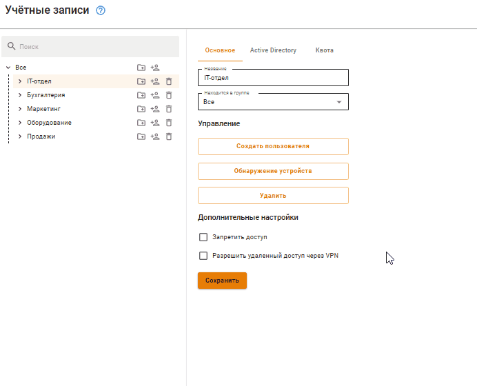
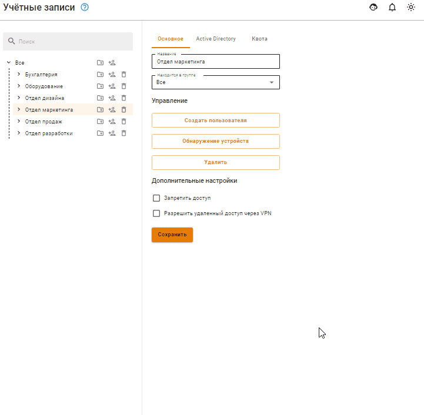
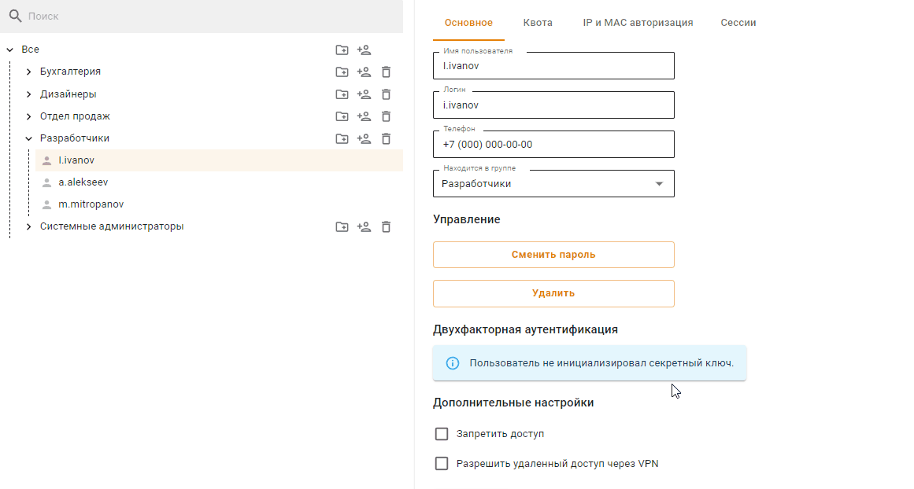
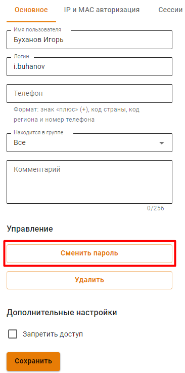

# Управление пользователями

## Общее

В дереве пользователей есть соответствующие кнопки, чтобы управлять группами и учетными записями:

|                   Обозначение                   | Описание                                       |
| :---------------------------------------------: | ---------------------------------------------- |
|  | Создать учетную запись пользователя            |
|    | Создать группу                                 |
|    | Удалить учетную запись пользователя или группу |

## Создание учетной записи пользователя

Создать учетную запись пользователя можно в определенной группе или вне групп:

* **В определенной группе** - выберите группу, нажмите кнопку **Создать пользователя** во вкладке **Основное** или  рядом с названием группы в дереве: 

* **Вне групп** - выберите группу **Все** в дереве пользователей и нажмите : 

Логин необходимо вводить латинскими символами в нижнем регистре, например, i.ivanov.

При заполнении **Дополнительных настроек** будет создано соответствующее правило в карточке пользователя во вкладке **IP и MAC авторизация** и в разделе **Авторизация -> IP и MAC-авторизация**.\
Но если этот IP- или MAC-адрес будет использоваться в правилах [DHCP-сервера](../../../../ngfw/settings/services/dhcp.md), то правило DHCP-сервера будет выполняться в приоритете.

Рекомендации к созданию сложности паролей (можно автоматически сгенерировать пароль):

* минимальная длина - 11 символов;
* использование строчных и заглавных латинских символов;
* использование цифр и специальных символов.



Не используйте Numpad при введении пароля, поскольку в будущем это может привести к проблемам при авторизации пользователя.





**Телефон** указывается для [Двухфакторной аутентификации](../../../../ngfw/settings/users/authorization/vpn-connection/two-factor-authentication.md).

Кнопка **Получить MAC по IP** будет активна, если IP пользователя и IP Ideco NGFW в одной подсети.



Для учетных записей, импортированных из MS Active Directory (AD), проверка пароля осуществляется средствами AD. Настройка авторизации пользователей Active Directory производится в соответствующем [разделе](../../../../ngfw/settings/users/active-directory/active-directory-user-authorization.md).

Создать пользователя Ideco NGFW в группу Active Directory нельзя. Если требуется добавить дополнительного пользователя в группу Active Directory, это необходимо делать в дереве пользователей на контроллере домена.



Посмотреть или восстановить пароль учетной записи пользователя нельзя, допускается только его изменение.



После определения всех параметров нажмите кнопку **Сохранить**. Создастся учетная запись, для которой автоматически будут установлены значения некоторых параметров группы (в зависимости от того, в какой группе она была создана).

{#top}



Для создания группы нужно нажать на соответствующий элемент управления, который находится справа от названия группы (можно создать как группу в корне дерева, так и дочернюю).

Откроется окно, в котором нужно указать название новой группы и нажать кнопку **Сохранить**:



## Удаление учетной записи пользователя или группы

Для удаления учетной записи пользователя необходимо навести курсор на пользователя и нажать на соответствующий элемент управления. Также можно выбрать нужного пользователя и нажать на кнопку **Удалить** на вкладке **Основное**:

Удаление группы осуществляется аналогичным образом.

## Перемещение учетной записи пользователя

Чтобы переместить учетную запись пользователя в другую группу, выделите этого пользователя и на вкладке **Основное** найдите поле **Находится в группе**. Из выпадающего списка выберите группу, в которую надо переместить пользователя, и нажмите на кнопку **Сохранить**:

## Редактирование учетной записи пользователя

Редактирование логина и пароля возможно на вкладке **Пользователи -> Учетные записи** при выделении нужного пользователя.

