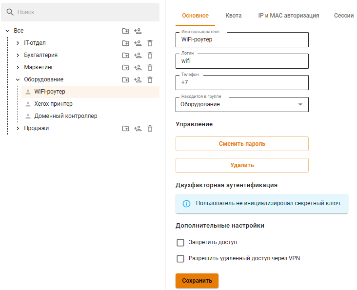
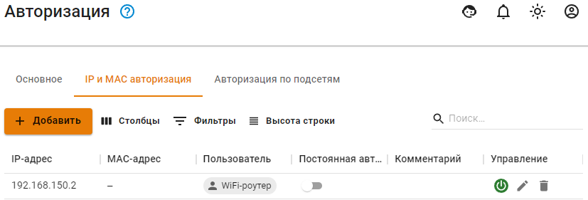

# Wi-Fi-сети

В текущей версии Ideco NGFW не поддерживает Wi-Fi-адаптеры. Для работы беспроводных клиентов необходимо использовать беспроводные точки доступа или\
Wi-Fi-маршрутизаторы.

Для выхода в интернет пользователей, подключающихся по Wi-Fi, необходима их авторизация на NGFW или авторизация Wi-Fi-роутера - это зависит от режима работы маршрутизатора.

{#top}



В режиме точки доступа или bridge устройство Wi-Fi предоставляет возможность беспроводным клиентам подключаться к локальной сети.

Для этого индивидуально авторизуйте всех беспроводных клиентов на Ideco NGFW с помощью IP-авторизации. Воспользуйтесь следующими рекомендациями по настройке:

* Используйте отдельную логическую сеть для клиентов Wi-Fi с настроенным [DHCP-сервером](../../../ngfw/settings/services/dhcp.md). При этом на локальный интерфейс Ideco NGFW добавьте IP-адрес, служащий шлюзом для этой сети;
* [Создайте группу](../../../ngfw/settings/users/user-tree/user-management.md#sozdanie-gruppy) в разделе **Пользователи -> Учетные записи** и настройте добавление в эту группу пользователей помощью [обнаружения устройств](../../../ngfw/settings/users/device-discovery.md);
* С помощью [контент-фильтра](../../../ngfw/settings/access-rules/content-filter/README.md) и [файрвола](../../../ngfw/settings/access-rules/firewall.md) настройте необходимые ограничения\
  для пользователей Wi-Fi;
* Если Wi-Fi-роутер подключен к отдельному физическому интерфейсу NGFW, то в файрволе запретите доступ из беспроводной сети в локальную сеть.

Пример настройки интерфейса для клиентов, подключающихся по Wi-Fi:

* **10.0.1.146/24** - шлюз для беспроводной Wi-Fi-сети;
* **10.0.0.193/24** - шлюз для локальной Ethernet-сети.

#### Настройка DHCP:

1\. Добавьте отдельную логическую сеть для клиентов Wi-Fi;

2\. Добавьте в сетевые интерфейсы шлюз созданной сети;

3\. Перейдите в раздел DHCP-сервер и выберите сетевой интерфейс, настроенный на прошлом шаге;

4\. Назначьте диапазон IP-адресов для DHCP-сервера и нажмите **Сохранить**.

При необходимости индивидуальной авторизации Wi-Fi-пользователей (учета трафика и статистики каждого конкретного пользователя устройств) воспользуйтесь [авторизацией через веб-браузер](authorization/web-authorization.md). При таком способе авторизации Ideco NGFW будет учитывать каждого пользователя, подключившегося по Wi-Fi. Учтите этот момент при планировании лицензирования Ideco NGFW.



{#top}



В данном режиме устройство Wi-Fi скрывает за NAT устройства беспроводной сети. Таким образом для Ideco NGFW достаточно будет авторизовать только точку доступа, как одного из пользователей.

Пример настройки пользователя в режиме роутера представлен на скриншотах ниже:

1\. Создайте пользователя для Wi-Fi-роутера.

Пароль у пользователя может быть любой.

2\. В разделе **Пользователи -> Авторизация -> IP и MAC авторизация** создайте правило следующего вида:

К пользователю необходимо применить общие ограничения [контент-фильтра](../../../ngfw/settings/access-rules/content-filter/README.md) и [файрвола](../../../ngfw/settings/access-rules/firewall.md) для Wi-Fi-сети.

#### Настройка DHCP:

В большинстве случаев при работе маршрутизатора в таком режиме не требуется дополнительной настройки DHCP-сервера Ideco NGFW, поскольку работает встроенный DHCP-сервер маршрутизатора. Если у вас не получилось подключиться к Wi-Fi-сети, то нужно проверить работу DHCP-сервера маршрутизатора.

При этом способе авторизации Ideco NGFW будет использоваться одна лицензия на точку доступа Wi-Fi. Отдельно настроить фильтрацию трафика и считать статистику по трафику в отчетах для отдельных клиентов Wi-Fi будет невозможно.



