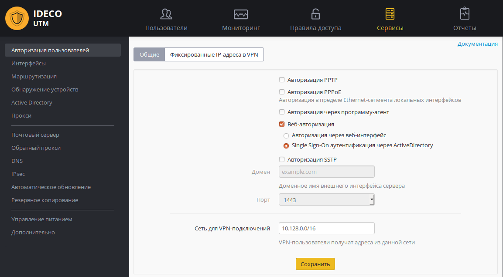
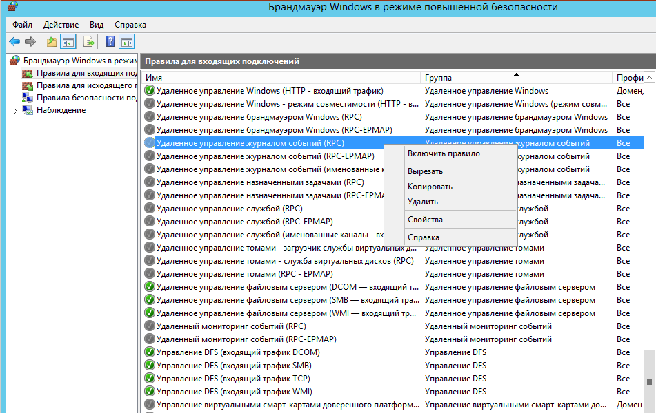
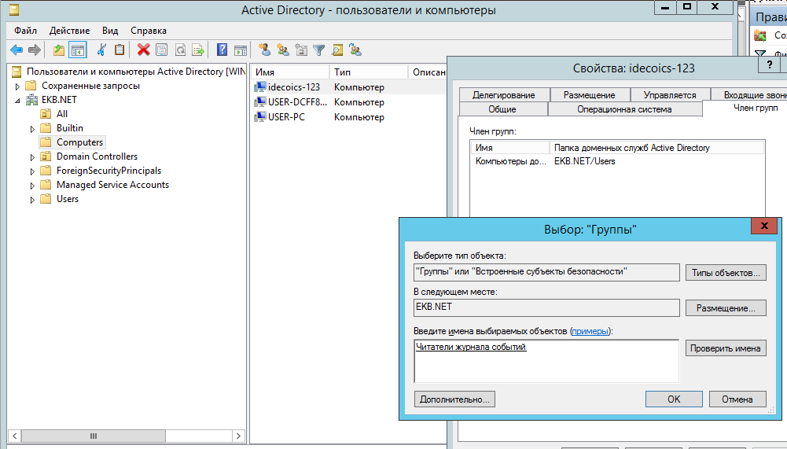
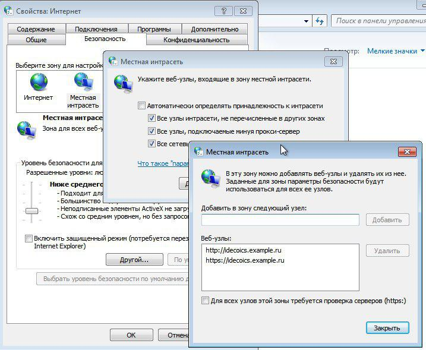
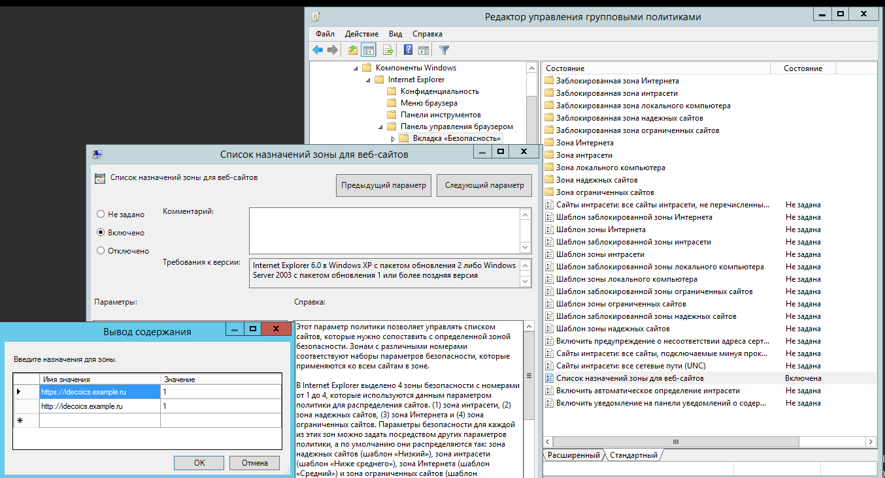
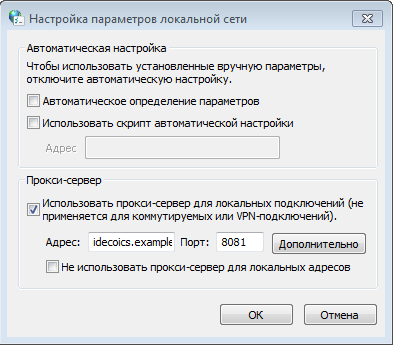
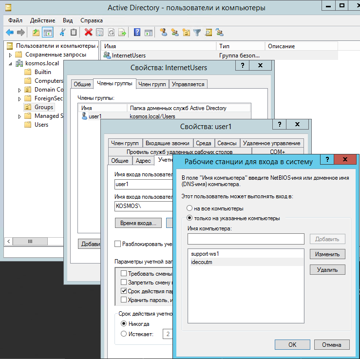

# Авторизация пользователей

## Настройка авторизации пользователей

Для пользователей, импортированных из Active Directory, доступны все [типы авторизации](../../../tipy_avtorizacii/) пользователей. Наиболее часто используемый вариант авторизации пользователей - **Single Sign-On аутентификация через Active Directory** - с использованием Kerberos/NTLM для авторизации через веб-браузер и логов контроллера домена \(рекомендуется одновременное использование обоих типов авторизации\). Необходимые настройки Ideco UTM и политик Active Directory описаны в данной статье.

### Настройка Ideco UTM

* Включите данный тип авторизации на вкладке **Сервисы -&gt; Авторизация пользователей -&gt; Включить веб-авторизацию -&gt; Single Sign-On аутентификация через Active Directory**. И нажмите кнопку **Сохранить**.

* На вкладке **Сервер -&gt; Active Directory** установите флажок **Разрешить авторизацию по логам**.  

### Настройка компьютеров пользователей и политик домена

#### Авторизация по логам контроллера домена AD

_Поддерживается начиная с версии контроллера домена 2008 standard edition и UTM 7.6._

Для работы авторизации по логам безопасности необходимо выполнить настройку на основном контроллере домена:

* В настройках брандмауэра Windows **на всех контроллерах домена \(или доменов\)** разрешить удаленный доступ к логам безопасности.

* Добавить Ideco UTM в группу безопасности **Читатели журнала событий \(Event Log Readers\).**

* После настройки доступа к логам, необходим **перезапуск службы авторизации по логам на Ideco UTM**, для этого снимите и снова установите флажок **Разрешить авторизацию по логам**, на вкладке **Сервисы -&gt; Active Directory**.
* Если вы изменяли политики безопасности контроллеров домена по сравнению со стандартными, то нужно включить логирование в политиках безопасности, нужно активировать следующий параметр: **Default Domain Controllers Policy -&gt; Computer Configuration -&gt; Policies -&gt; Windows Settings -&gt; Security Settings -&gt; Advanced Audit Policy Configuration -&gt; Audit Policies -&gt; Logon/Logoff -&gt; Audit Logon -&gt; Success.**
* Также необходимо включить следующие параметры:  **Default Domain Controllers Policy -&gt; Computer Configuration-&gt;Policies-&gt;Windows Settings-&gt;Security Settings-&gt; Advanced Audit Policy Configuration -&gt; Audit Policies -&gt; Account login -&gt; "Аудит службы проверки подлинности Kerberos" и "Аудит операций билета службы керберос" -&gt;Success**.
* Для обновления политик контроллеров доменов нужно выполнить команду: `gpupdate /force`.
* Если авторизация пользователей при логине не происходит, нужно проверить в журнале безопасности наличие событий 4768, 4769, 4624

#### Веб-авторизация \(SSO или NTLM\)

Для работы **авторизации через веб-браузер** \(с использованием Kerberos либо NTLM\) необходима настройка Internet Explorer \(остальные браузеры подхватывают его настройки\). Обязательно используйте эти настройки, даже если обычно пользователи авторизуются по логам безопасности, в некоторых случаях будет необходима их авторизация браузером:

* Зайдите в свойства браузера на вкладку **Безопасность**.
* Выберите **Местная интрасеть** и нажмите кнопку **Сайты**.
* В открывшемся окне нажмите кнопку **Дополнительно**.
* Добавьте в открывшемся окне ссылку на Ideco UTM под тем именем, под которым вы ввели его в домен. На примере: Ideco UTM введен в домен `example.ru` под именем idecoUTM.  

  Нужно указывать два URL: c http:// и с https://.

Также данную настройку можно сделать с помощью групповых политик Active Directory сразу же для всех пользователей. В групповых политиках для пользователей нужно настроить:

**Конфигурация пользователя - Политики - Административные шаблоны - Компоненты Windows - Internet Explorer - Панель управления браузером - Вкладка безопасность - Список назначений зоны для веб-сайтов.**  
**Введите назначение зоны для DNS-имени Ideco UTM \(в примере `idecoUTM.example.ru`\) значение 1 \(интрасеть\). Необходимо указать два значения, для схем работы по http и https:**



При входе на HTTPS-сайт, для авторизации необходимо разрешить браузеру доверять сертификату Ideco UTM \(чтобы не делать это каждый раз, можно добавить корневой сертификат Ideco UTM в доверенные корневые сертификаты устройства. Например, с помощью [политик домена](../../../pravila_dostupa/kontent-filtr/nastroika_filtracii_https.md). Можно использовать [скрипты](skripty_avtomaticheskoi_avtorizacii_razavtorizacii.md) ****для автоматической авторизации пользователей при логине.



Для браузера **Mozilla Firefox** в about:config требуются настроить два параметра: `network.automatic-ntlm-auth.trusted-uris` и `network.negotiate-auth.trusted-uris`, добавив в них адрес локального интерфейса Ideco UTM \(например `idecoUTM.example.ru`\).  
Параметр `security.enterprise_roots.enabled` в значении true позволит Firefox-у доверять системным сертификатом и авторизовать пользователей при переходе на HTTPS-сайты.

Настройте about:config в firefox следующим образом:  
**`security.enterprise_roots.enabled = true   
network.automatic-ntlm-auth.trusted-uris = Доменное имя Ideco UTM в вашей сети, например idecoUTM.example.ru   
network.negotiate-auth.trusted-uris = Доменное имя Ideco UTM в вашей сети, например idecoUTM.example.ru`**

Также для пользователей, импортированных через AD, возможны все способы авторизации:

* [Авторизация через Ideco Agent](../../../tipy_avtorizacii/avtorizaciya_cherez_ideco_agent.md) - подходит для авторизации пользователей терминальных серверов \(с использованием Remote Desktop IP Virtualization на терминальном сервере\).
* [Авторизация по IP-адресу](../../../tipy_avtorizacii/avtorizaciya_po_ip-adresu.md) - подходит в случае, если пользователи всегда работают с фиксированных IP-адресов. IP-адреса на UTM необходимо прописывать вручную каждому пользователю.
* [Авторизация по PPTP](../../../tipy_avtorizacii/avtorizaciya_po_pptp.md) - если в сети предъявляются повышенные требования к конфиденциальности информации, передаваемой между шлюзом и устройствами пользователей, или используется слабо защищенный от перехвата трафика WiFi.

## Настройка авторизации пользователей при прямых подключениях к прокси-серверу

Настройка прозрачной авторизации пользователей при прямых подключениях к прокси-серверу аналогична настройке прозрачной **Single Sign-On** авторизации, описанной выше в инструкции.

Единственной особенностью является необходимость указания в качестве адреса прокси-сервера **не IP-адреса Ideco UTM, а его DNS-имени**.

### Настройка браузера Mozilla Firefox для авторизации по NTLM при прямом подключении к прокси-северу на UTM

Для компьютеров, которые **не находятся в домене Active Directory**, в случае необходимости их авторизации под доменным пользовательским аккаунтом в браузере Firefox необходимы следующие его настройки:

на странице настроек браузера \(about:config в адресной строке\) установите следующим параметрам значение _**false:**_**`network.automatic-ntlm-auth.allow-proxies network.negotiate-auth.allow-proxies`**



Не отключайте данные опции для компьютеров, входящих в домен Active Directory, т.к. в таком случае будет использоваться устаревший метод авторизации по NTLM.



## Возможные ошибки авторизации

* Если пользователь видит окно Internet Explorer с текстом **Для получения доступа требуется аутентификация** и авторизация происходит только при ручном переходе по ссылке на авторизацию, значит по каким-то причинам не происходит редирект в браузере на страницу авторизации \(он может быть ограничен настройками безопасности браузера\). Параметр **Активных сценариев** в Internet Explorer должен быть установлен в значение **Включить**.

* Доменному пользователю должно быть разрешено авторизоваться на Ideco UTM \(введенном в домен под выбранным при входе в домен именем\), в случае, если вы ограничиваете возможность авторизации пользователей  избранными компьютерами.  

* При авторизации по логам безопасности контроллера домена Active Directory пользователи будут авторизованы при попытке выхода в Интернет \(любым трафиком\), после их логина на компьютере.  Автоматической авторизации без прохождения трафика через UTM не

  происходит, т.к. используется конкурентная политика авторизации. При этом "лишние" лицензии заняты не будут.

