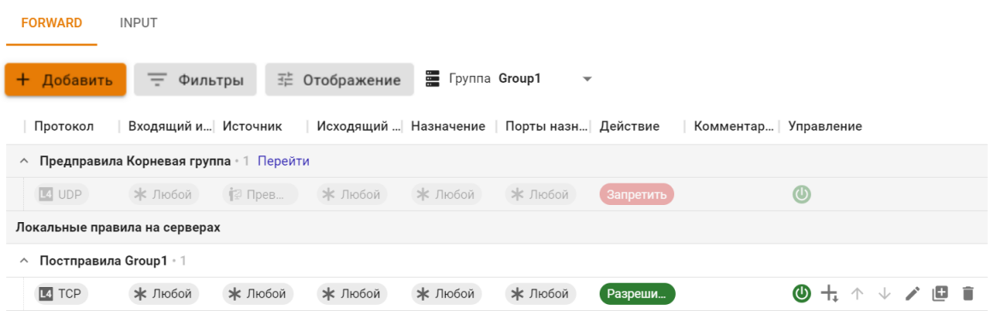
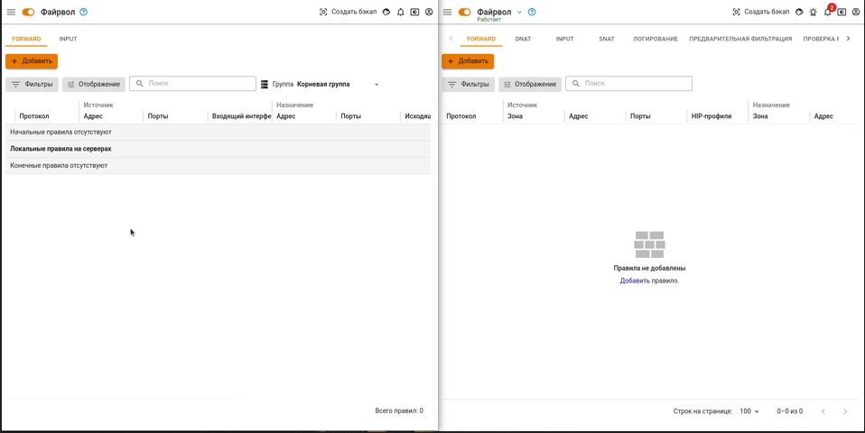
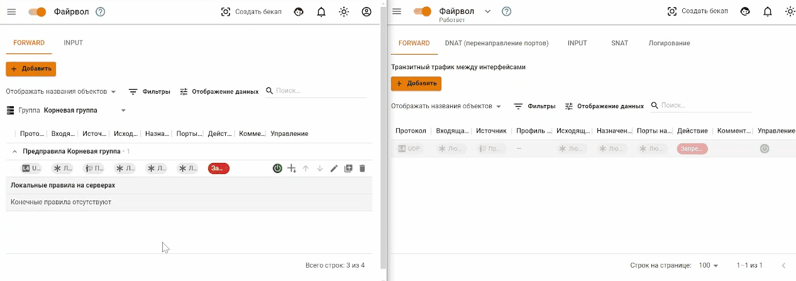
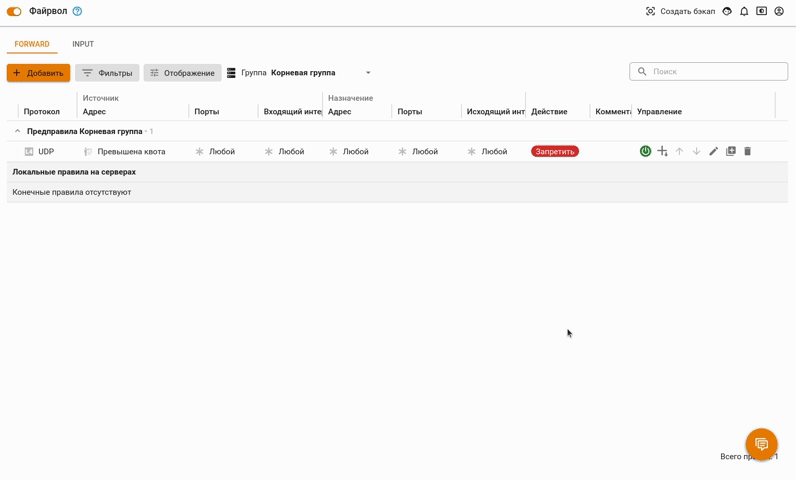
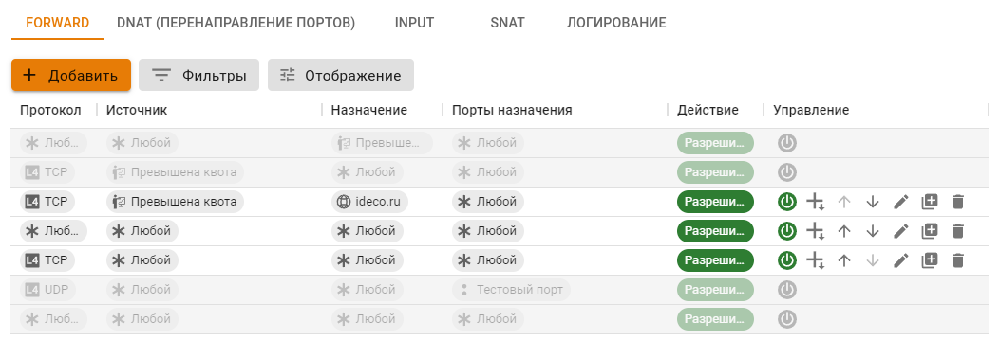
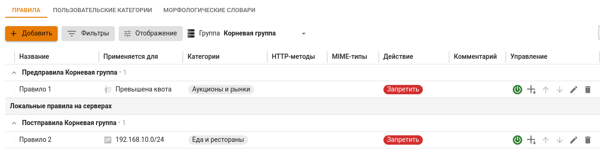
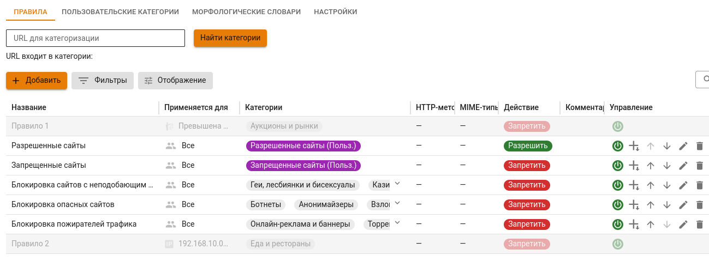
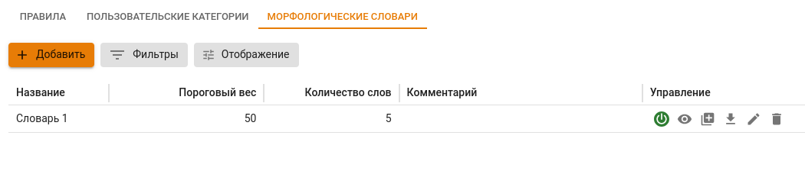
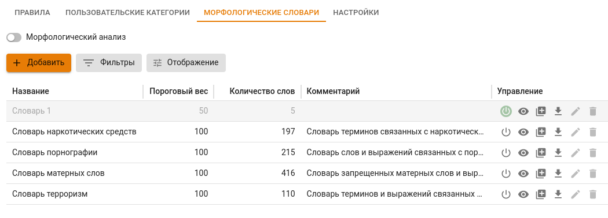

# Политики и объекты

## Политики безопасности

Управляйте объектами и правилами на всех подключенных Ideco NGFW одновременно.

В разделе **Контент-фильтр** можно создать пользовательские категории на одноименной вкладке и использовать их для создания правил контентной фильтрации.

В Ideco NGFW из Ideco Center переносятся только те настройки, которые присутствуют в центральной консоли. Принципы работы разделов **Файрвол**, **Контент-фильтр** и **Ограничение скорости** с подключенными NGFW идентичен. Рассмотрим на примере раздела **Файрвол**.



На Ideco NGFW будут распространяться правила и политики безопасности всех вышестоящих групп в соответствии с вложенностью. Правила **Корневой группы** распространяются на все подключенные NGFW.



### Файрвол

Файрвол Ideco Center содержит только таблицы FORWARD и INPUT. Правила в них объединены в соответствии с группами серверов:

Пример добавления правил через Ideco Center.\
*Слева - интерфейс Ideco Сenter, справа - интерфейс Ideco NGFW*:

<!--  -->

{#top}



Созданные в Ideco Center правила FORWARD отображаются в виде двух таблиц: **Начальные правила** и **Конечные правила**. Правила применяются на подключенных Ideco NGFW в следующем порядке: сначала - **Начальные правила** Ideco Center, затем - **Локальные правила** NGFW, затем - **Конечные правила** Ideco Center.

Чтобы созданное правило попало в таблицу **Начальные правила**, укажите в строке **Вид правила** значение **Предправило**. Если правило требуется разместить в таблице **Конечные правила**, выберите значение **Постправило**.



Перемещать правила между таблицами **Начальные правила** и **Конечные правила** нельзя.



**Начальные правила** и **Конечные правила** в Ideco Center создаются для определенной группы серверов. Группа указывается при создании правила в строке **Группа серверов**.

Чтобы увидеть все правила, распространяющиеся на группу серверов, выберите название группы над таблицей:

<!-- В таблице отобразятся все правила, распространяющиеся на выбранную группу, с учетом вложенности групп. -->

Чтобы изменить группу серверов, на которую распространяется правило, нажмите на  и измените группу в соответствующей строке.



{#top}



Таблица в Ideco NGFW визуально делится на три части: верхняя, средняя и нижняя.

В верхнюю и нижнюю часть переносятся правила из подключенного Ideco Center. Управление этими правилами в Ideco NGFW невозможно. *Верхняя* часть соответствует таблице **Начальные правила** в Ideco Center. *Нижняя* часть - таблице **Конечные правила**.

В *средней* части находятся **Локальные правила**, которые создаются администратором NGFW в самом NGFW.



**Локальные правила на серверах Ideco NGFW** не видны в интерфейсе Ideco Center. \
Для просмотра перейдите в раздел **Серверы**, нажмите на  в строке с нужным Ideco NGFW и перейдите в раздел **Файрвол**.





## Контроль приложений

Механизм работы правил **Контроля приложений** изменился, создайте профили безопасности **[Контроля приложений](../settings-cc/security-profiles.md#контроль-приложений)** и добавьте их в обработку правилами **[Файрвола](../settings-cc/policies-and-objects.md#файрвол)**.

## Контент-фильтр

**Контент-фильтр** проверяет наличие сайта, который хочет открыть пользователь, в списках ресурсов Ideco NGFW. Если адрес находится в этих списках, то применяются настроенные правила фильтрации. 

Процессы создания правил в Ideco Center и в [Ideco NGFW](../ngfw/settings/access-rules/content-filter/rules.md) аналогичны. Созданные в Ideco Center правила **Контент-фильтра** переносятся в подключенные Ideco NGFW в соответствии с группами серверов.

Созданные в Ideco Center правила **Контент-фильтра** можно включать и редактировать только в Центральной консоли. В Ideco NGFW они доступны только для просмотра.

Правила **Контент-фильтра**:

* В Ideco Center:

* В подключенном Ideco NGFW:

На вкладке **Морфологические словари** создаются и редактируются словари, которые можно использовать для проведения морфологического анализа сайтов в подключенных Ideco NGFW. В Ideco Center включить морфологический анализ нельзя. Процессы создания **Морфологических словарей** в Ideco Center и в [Ideco NGFW](../ngfw/settings/access-rules/content-filter/morphological-dictionaries.md) аналогичны.

Созданные в Ideco Center **Морфологические словари** можно включать и редактировать только в Центральной консоли. В Ideco NGFW они доступны только для просмотра.

Морфологические словари:

* В Ideco Center:

* В подключенном Ideco NGFW:

## Объекты

Объекты, созданные в Ideco Center, переносятся в подключенные Ideco NGFW. Администратор Ideco NGFW может использовать эти объекты для создания правил.

При удалении объекта из Ideco Center, объект удаляется и из Ideco NGFW. Если в Ideco NGFW было создано правило с удаленным объектом, то этот объект будет отмечен иконкой .



Принцип создания и удаления объектов в Ideco Center соответствуют принципам Ideco NGFW. Подробное описание в статье [Объекты](../ngfw/settings/access-rules/aliases.md).



