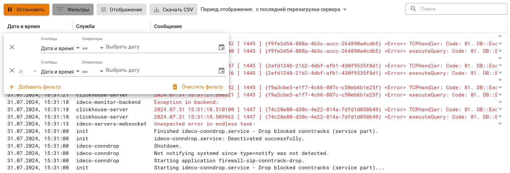
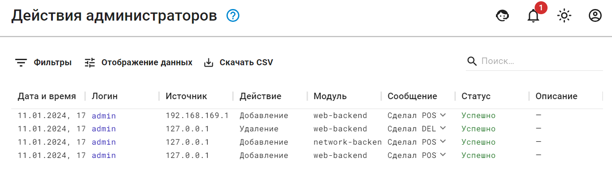

# Отчеты и журналы

## Системный журнал



Время хранения логов в разделе **Журналы** - три месяца. После этого логи доступны в разделе **Управление сервером -> Терминал**.



Для просмотра логов определенной службы воспользуйтесь строкой поиска или фильтром.
Для фильтрации логов по нескольким параметрам нажмите **Добавить фильтр** и выберите соответствующий критерий, значение и оператор в форме:



По кнопке **Скачать CSV** сохраняются те строки логов, которые заданы фильтрацией.



{#top}



* **Серверы** - `ideco-servers-backend`, `ideco-servers-websocket`;
* **Файрвол** - `ideco-firewall-backend`;
* **Контроль приложений** - `ideco-app-backend`;
* **Контент-фильтр** - `ideco-content-filter-backend`;
* **Предотвращение вторжений** - `ideco-suricata-event-syncer`, `ideco-suricata-backend`;
* **Объекты** - `ideco-alias-backend`;
* **Сетевые интерфейсы** - `ideco-network-backend`, `ideco-network-nic`;
* **Маршрутизация** - `ideco-routing-backend`, `ideco-routing-rest`;
* **Обратный прокси** - `ideco-reverse-backend`;
* **DNS** - `ideco-dns-backend`, `unbound`, `nsd`, `unbound-anchor`, `unbound-keygen`;
* **NTP** - `chronyd`;
* **Кластеризация** - `ideco-cluster-backend`;
* **Обновления** - `ideco-sysupdate-backend`;
* **Бэкапы** - `ideco-backup-backend`;
* **Лицензия** - `ideco-license-backend`;
* **Syslog** - `ideco-logs-backend`;
* **Отчеты и журналы** - `ideco-logs-backend`, `ideco-logs-syncer`;
* **Действия администраторов** - `ideco-audit-backend`;
* **Сертификаты** - `ideco-cert-backend`;
* **Сбор анонимной статистики о работе сервера** - `ideco-gatherstat-backend`;
* **Локальное меню** - `ideco-local-menu`;
* **Дополнительно (язык, часовой пояс, включение особых режимов работы)** - `ideco-system-backend`;
* **Защита от повторяющихся зловредных или подозрительных действия, в т.ч. от брутфорс-атак (brute force - атака полным перебором)** - `fail2ban`;
* **Доступ по SSH** - `sshd`.

**Служебное:**

* `clickhouse-server` - сервер базы данных;
* `ideco-etcd-runtime`, `ideco-etcd-permanent` - локальная база данных;
* `prometheus`, `prometheus-node-exporter` - сбор метрик и статистики.



## Действия администраторов

Ideco Center логирует действия администраторов, которые вносят изменения в конфигурацию Ideco Center из веб-интерфейса, локального меню и терминала.

