# Серверы



При синхронизации Ideco Center и Ideco NGFW с разными мажорными версиями передача правил с Ideco Center происходить не будет. При этом в разделе **Серверы** будет информация о том, что Ideco Center и Ideco NGFW несовместимы:

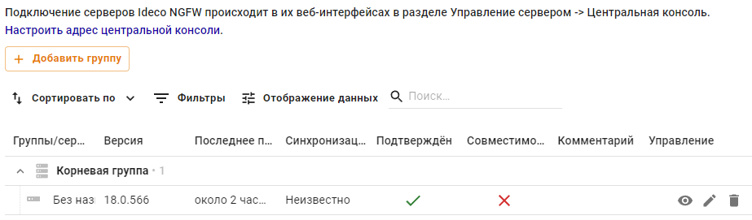



В разделе **Серверы** можно группировать синхронизированные с ней серверы NGFW и формировать из них древовидную структуру. Это позволит управлять сразу несколькими серверами, применять правила и политики безопасности ко всем серверам определенной группы.



Особенности работы:

* Если в подключаемом Ideco NGFW используется кластер, достаточно подключить только активную ноду, пассивная автоматически примет эту настройку;
* Сетевое подключение производится в направлении от Ideco NGFW к Ideco Center, т. е. возможна связь и когда Ideco NGFW за NAT;
* Если сервер Ideco Center находится за NAT, укажите IP-адрес NAT-устройства или доменное имя в разделе **Управление сервером -> Дополнительно -> Адрес центральной консоли**;
* Для обновления серверов, подключенных к центральной консоли, перейдите в интерфейс NGFW одним из указанных выше способов и воспользуйтесь статьей [Обновления](../ngfw/settings/server-management/server-update.md);
* Для подключения нескольких Ideco NGFW к Ideco Center рекомендуем настроить VPN-подключение через IPsec. Альтернативный способ - создать правило DNAT в веб-интерфейсе Ideco NGFW.



{#top}



Если между офисами отсутствует VPN-подключение, для подключения нескольких Ideco NGFW к Ideco Center можно настроить проброс портов. Вместо подключения по IPsec в этом случае настраивается перенаправление портов.

Чтобы выполнить настройку, необходимо создать два одинаковых правила для протоколов **UDP** и **TCP** в разделе **Правила трафика -> Файрвол -> DNAT**:

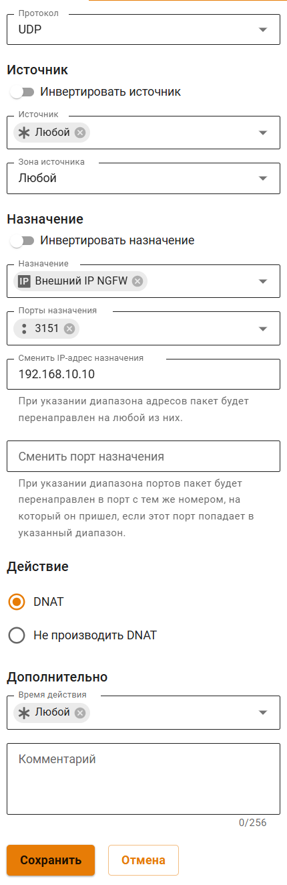

* **Назначение источника** - внешний IP-адрес Ideco NGFW;
* **Сменить IP-адрес назначения** - внутренний IP-адрес Ideco Center;
* **Порт** - только порт 3151.

При применении настроенного правила трафик проходит в локальную сеть через внешний интерфейс и перенаправляется в Ideco Center. При получении трафика Ideco Center отправляет подтверждение.



{#top}



1\. Перейдите в раздел **Управление сервером -> Центральная консоль**;

2\. Введите IP-адрес или доменное имя в строке **Сервер центральной консоли** и нажмите **Подключить**:

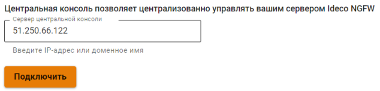

Если вместо доменного имени указан IP-адрес Ideco Center, загрузите корневой сертификат Ideco Center в Ideco NGFW:

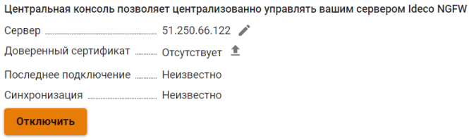

Скачать корневой сертификат можно в Ideco Center, раздел **Сервисы -> Сертификаты**.

3\. В интерфейсе Ideco Center перейдите в раздел **Серверы** и подтвердите подключение кнопкой .

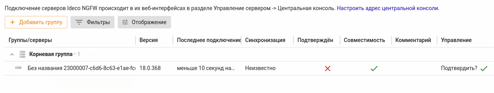



**Для удаления сервера Ideco NGFW из Ideco Center разорвите привязку в интерфейсе Ideco Center:**

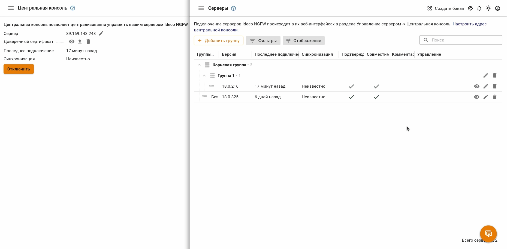

<!-- Для этого в таблице **Серверы** в столбце **Управление** напротив нужного сервера выберите  и подтвердите выбор. -->

## Переход из веб-интерфейса Ideco Center в веб-интерфейс Ideco NGFW

В Ideco Center предусмотрено два способа перехода в Ideco NGFW:

1\. Перейдите в раздел **Серверы** и нажмите на . В новой вкладке откроется веб-интерфейс Ideco NGFW:

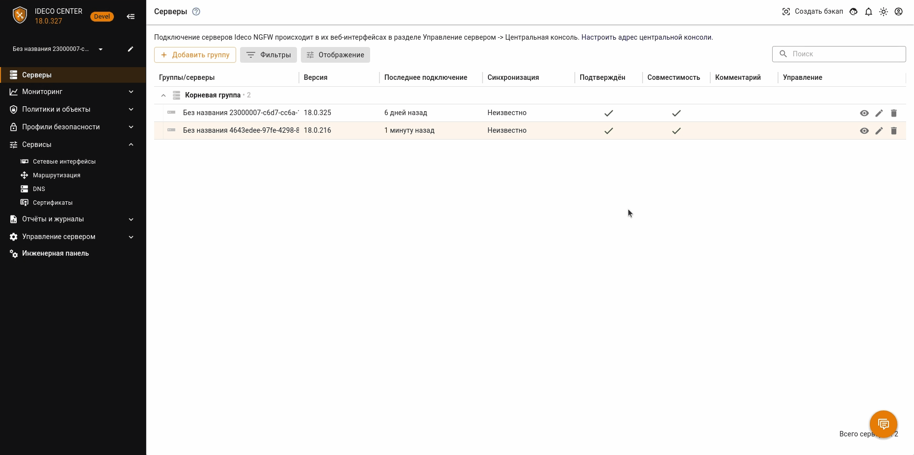

2\. Нажмите на  в левом верхнем углу и выберите нужный NGFW:

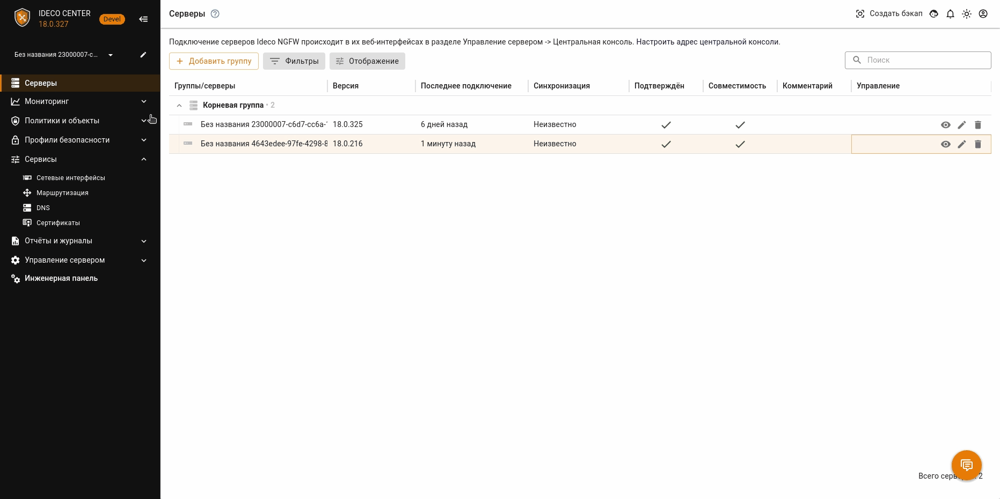



При переходе из Ideco Center в веб-интерфейс Ideco NGFW внутри иконки  в шапке блокируются кнопки **Профиль** и **Выход**.





Чтобы перейти к веб-интерфейсу VCE подключенных серверов в Ideco Center, выполните следующие действия:

1\. Зайдите в веб-интерфейс NGFW, используя один из указанных способов.

2\. Затем следуйте инструкциям из [статьи](../ngfw/settings/server-management/vce.md#переход-в-веб-интерфейс-виртуального-сервера).



## Группировка серверов Ideco NGFW

Структура групп серверов в Ideco Center предполагает три уровня вложенности. Первый - Корневая группа. В нее по умолчанию попадают все серверы NGFW, впервые синхронизированные с Ideco Center, а также все группы, созданные администратором.

При этом на Ideco NGFW будут распространяться правила и политики безопасности всех вышестоящих групп в соответствии с вложенностью.



Серверы NGFW, подключенные к Ideco Center, и группы по умолчанию, созданные в центральной консоли, являются частью **корневой группы** и не могут быть вынесены оттуда.



### Создание, редактирование и удаление групп серверов

{#top}



1\. Перейдите в раздел **Серверы** и нажмите **Добавить группу**.

2\. В открывшемся окне заполните **Название группы** и выберите родительскую группу из раскрывающегося списка (если это первая создаваемая группа, в нем будет только Корневая группа):

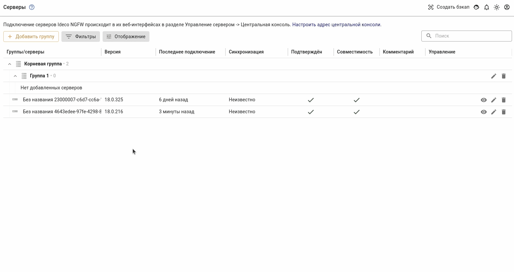

3\. Нажмите **Сохранить**.



{#top}



1\. Нажмите на  напротив ее названия.

2\. В открывшемся окне можно изменить название и родительскую группу:

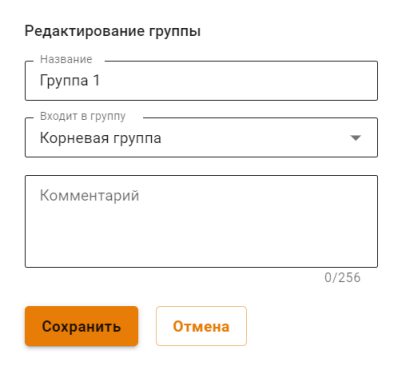



{#top}



Чтобы удалить группу серверов, нажмите на . Если в удаленной группе были серверы, то они переместятся в **Корневую группу** (удалить или отредактировать **Корневую группу** нельзя):

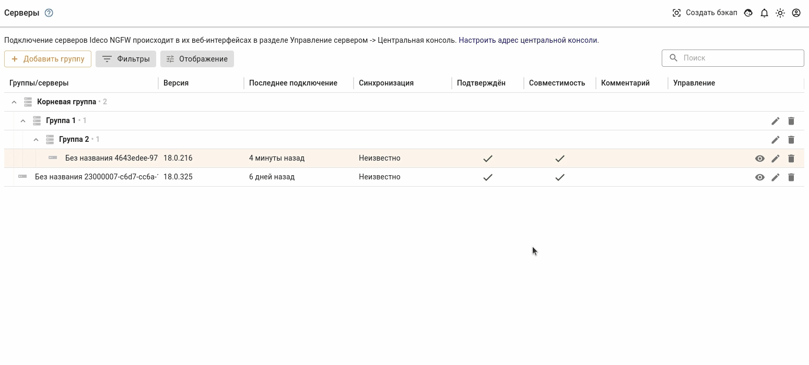



### Перемещение серверов Ideco NGFW между группами

Чтобы переместить синхронизированный с центральной консолью сервер Ideco NGFW из одной группы в другую, выполните действия:

1\. Нажмите на  напротив ее названия.

2\. В открывшемся окне из раскрывающегося списка выберите группу, в которую хотите переместить сервер:

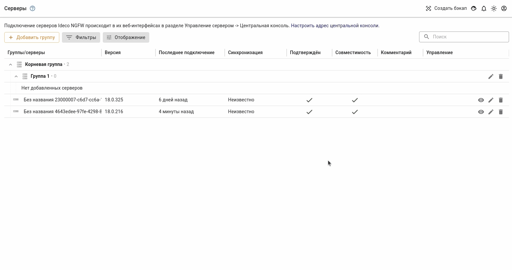



При подключении к Ideco Center сервера, настройки которого [восстановлены](../ngfw/recipes/popular-recipes/transferring-data-to-another-server.md) из бэкапа другого сервера, такой клон не появится в таблице серверов Ideco Center. Возникает конфликт с донором бэкапа из-за одинакового claster\_id.

В случае возникновения такой проблемы обратитесь в [Техническую поддержку](../ngfw/general/technical-support.md).



