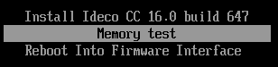

# Установка Ideco Center

**Технические требования для серверов и виртуальных машин:**

|Комплектующие|Минимальные системные требования|
|-------------|--------------------------------|
|Процессор|Intel i3/i5/i7/i9/Xeon с поддержкой SSE 4.2|
|Объем оперативной памяти|16 ГБ (16-64 ГБ в зависимости от количества пользователей)|
|Дисковая подсистема|SSD объемом 150 Гб или больше, с интерфейсом SATA, mSATA, SAS, NVMe|
|Сеть|Одна сетевая карта. Рекомендуется использовать карты на чипах Intel|
|Гипервизоры|VMware, Microsoft Hyper-V (виртуальные машины 2-го поколения), VirtualBox, KVM, Citrix XenServer, Proxmox VE|
|Дополнительно|Монитор и клавиатура|
|Замечания|Обязательна поддержка UEFI. Не поддерживаются программные RAID-контроллеры (интегрированные в чипсет). Для виртуальных машин необходимо использовать фиксированный, а не динамический размер хранилища и оперативной памяти|



**Обязательные условия для работы с Ideco Center:**

1\. Обязательная поддержка UEFI; \
2\. Для виртуальных машин необходимо использовать фиксированный, а не динамический размер хранилища и оперативной памяти; \
3\. Отключить режим Legacy загрузки, он может называться CSM (Compatability Support Module); \
4\. Отключить опцию Secure Boot в UEFI.



Файл для установки центральной консоли доступен для скачивания в [личном кабинете](https://my.ideco.ru/#/utm/download). Процесс установки Ideco Center аналогичен [процессу установки Ideco NGFW](../ngfw/installation/installation-process.md).

## Процесс установки



При установке Ideco Center с загрузочного USB диска выберите загрузку с USB диска в настройках UEFI компьютера.



Для установки Ideco Center выполните действия:

1\. Перейдите к установке, нажав **Install Ideco CC**.

2\. Выберите диск для установки и ознакомьтесь с **предупреждением об уничтожении данных на диске**:

3\. Выберите временную зону, в которой вы находитесь:

4\. Настройте дату и время в соответствии с вашей временной зоной. **Обязательно проверьте правильность даты и времени**:



Не забудьте извлечь USB диск после установки Ideco Center, чтобы загрузка с USB диска не началась заново.



## Создание учетной записи администратора

Для входа в веб-интерфейс Ideco Center нужно создать учетную запись администратора с соблюдением требований к паролю:

{#top}



* **Минимальная длина пароля** - 12 символов;
* **Содержит только строчные и заглавные латинские буквы**;
* **Содержит цифры**;
* **Содержит специальные символы** (! # $ % & ' * + и другие).





Если пароль не соответствует требованиям политики безопасности, то появится надпись с информацией, что пароль ненадежен. Потребуется ввести новый пароль с учетом требований к паролю.

Не используйте Numpad при введении пароля, поскольку в будущем это может привести к проблемам при авторизации администратора.



## Настройка локального интерфейса



При использовании сетевых карт одного производителя могут возникнуть трудности при идентификации сетевой карты для настройки сетевого интерфейса.
Для корректной идентификации сетевой карты используйте ее MAC-адрес.



Для настройки Ideco Center через веб-интерфейс нужно настроить локальный интерфейс в локальном меню:

1\. Введите номер сетевого адаптера, который будет использоваться в качестве локального сетевого интерфейса:

2\. Настройте локальную сеть автоматически через DHCP, введя **y**, или настройте вручную, введя **n**:

3\. Введите локальный IP-адрес и маску подсети в формате `ip/маска` и нажмите **Enter**:

4\. Введите адрес шлюза или оставьте поле пустым:

5\. Задайте тег VLAN (стандарт VLAN 802.3q) или оставьте поле пустым:

После создания локального интерфейса откроется локальное меню управления: 

