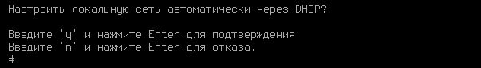
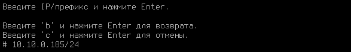
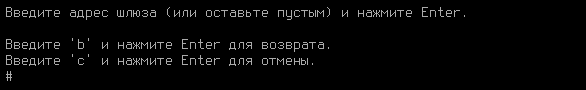
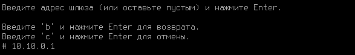
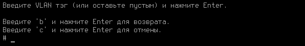
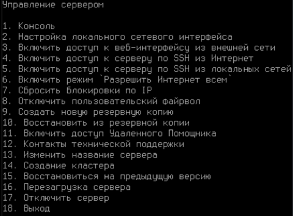

# Установка

## Процесс установки



При установке Ideco NGFW с загрузочного USB-диска выберите загрузку с USB-диска в настройках UEFI компьютера.




<!-- [Ссылка на видеоинструкцию по установке Ideco NGFW](https://rutube.ru/video/20b2277f194e98a4faebb1cc7a2f2df2/) -->

Для установки Ideco NGFW выполните действия:

1\. Перейдите к установке, нажав **Install Ideco NGFW**.

2\. Выберите диск и ознакомьтесь с **предупреждением об уничтожении данных на диске**:

3\. Выберите временную зону, в которой вы находитесь:

4\. Настройте дату и время в соответствии с вашей временной зоной. **Обязательно проверьте правильность даты и времени**:



Не забудьте извлечь USB-диск после установки Ideco NGFW, чтобы загрузка с него не началась заново.



## Создание учетной записи администратора

Для входа в веб-интерфейс (после уведомления "*Создание аккаунта администратора*"), создайте учетную запись администратора с соблюдением требований к паролю:

Требования к паролю

* **Минимальная длина пароля** - 12 символов;
* **Содержит только строчные и заглавные латинские буквы**;
* **Содержит цифры**;
* **Содержит специальные символы** (! # $ % & ' * + и другие).



Если пароль не соответствует требованиям политики безопасности, то появится надпись с информацией, что пароль ненадежен. Потребуется ввести новый пароль с учетом требований к нему.

Не используйте Numpad при введении пароля, поскольку в будущем это может привести к проблемам при авторизации администратора.



## Настройка второй ноды кластера

1\. Введите **y** для начала настройки NGFW как второй ноды кластера:

2\. Для продолжения настройки воспользуйтесь статьей [Кластеризация].

## Настройка локального интерфейса



При использовании сетевых карт одного производителя могут возникнуть трудности при идентификации сетевой карты для настройки сетевого интерфейса.
Для корректной идентификации сетевой карты используйте ее MAC-адрес.



Для настройки Ideco NGFW через веб-интерфейс нужно настроить локальный интерфейс в локальном меню шлюза:

1\. Введите номер сетевого адаптера под локальный интерфейс:

2\. Настройте локальную сеть автоматически через DHCP, введя **y**, или настройте вручную, введя **n**:

3\. Введите локальный IP-адрес и маску подсети в формате `ip/маска` и нажмите **Enter**:

4\. Введите адрес шлюза или оставьте поле пустым:
* При настройке **Ideco NGFW в качестве шлюза** оставьте поле шлюз пустым:

   

* При настройке **Ideco NGFW в качестве прокси** введите шлюз с доступом в интернет:

   

5\. Задайте тег VLAN (стандарт VLAN 802.3q) или оставьте поле пустым:

После создания локального интерфейса откроется локальное меню управления сервером: 



Если в Ideco NGFW настроен кластер, в локальном меню будет отсутствовать пункт _Восстановиться на предыдущую версию_.


